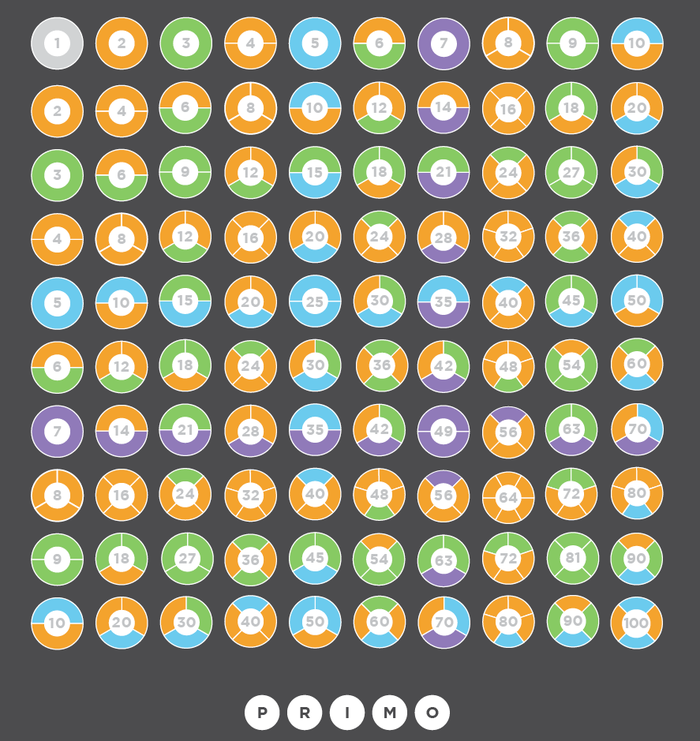

# 0x22. Prime Game

<h2>Requirements</h2>

<h3>C</h3>

<ul>
    <li>Allowed editors: <code>vi</code>, <code>vim</code>, <code>emacs</code></li>
    <li>All your files will be interpreted/compiled on Ubuntu 14.04 LTS using <code>python3</code> (version 3.4.3)</li>
    <li>All your files should end with a new line</li>
    <li>The first line of all your files should be exactly <code>#!/usr/bin/python3</code></li>
    <li>A <code>README.md</code> file, at the root of the folder of the project, is mandatory</li>
    <li>Your code should use the <code>PEP 8</code> style (version 1.7.x)</li>
    <li>All your files must be executable</li>
</ul>

## Tasks

| **Filename** | **Description** |
|---|---|
| [0. Prime Game](./0-prime_game.py) | Maria and Ben are playing a game. Given a set of consecutive integers starting from 1 up to and including n, they take turns choosing a prime number from the set and removing that number and its multiples from the set. The player that cannot make a move loses the game.

They play x rounds of the game, where n may be different for each round. Assuming Maria always goes first and both players play optimally, determine who the winner of each game is. |

<ul>
<li>Prototype: <code>int *find_substring(char const *s, char const **words, int nb_words, int *n);</code>, where

<ul>
    <li>Prototype: <code>def isWinner(x, nums)</code></li>
    <li>where <code>x</code> is the number of rounds and <code>nums</code> is an array of <code>n</code> </li>
    <li>Return: name of the player that won the most rounds</li>
    <li>If the winner cannot be determined, return <code>None</code></li>
    <li>You can assume <code>n</code> and <code>x</code> will not be larger than 10000</li>
    <li>You cannot import any packages in this task</li>
</ul>
 
 
#### Follow me

| Authors | GitHub | Twitter | Linkedin |
| :---: | :---: | :---: | :---: |
| Crispthofer Rincon | [crispthoalex](https://github.com/crispthoalex) | [@crispthoalex](https://twitter.com/crispthoalex) | [carmurrain](https://www.linkedin.com/in/carmurrain) |

### License
*`0x22. Prime Game` is open source and therefore free to download and use without permission.*

##### Holberton School  Advanced Program  AR/VR
##### January, 2022. Cali, Colombia
